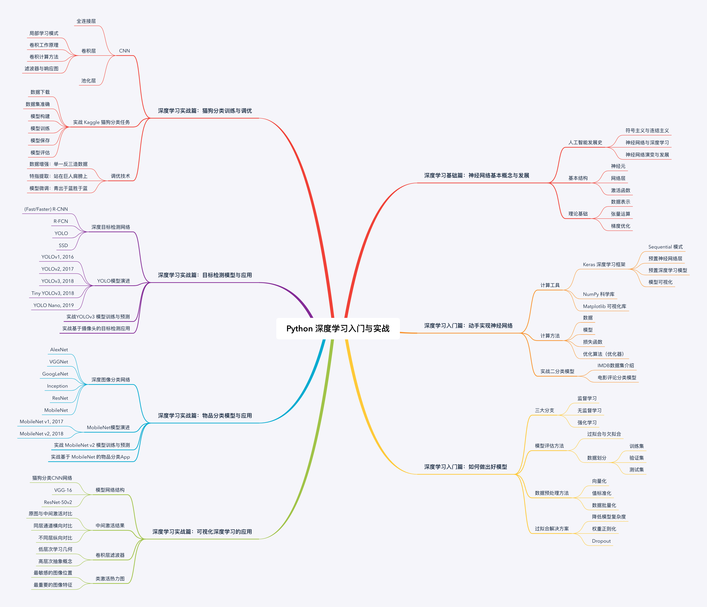

<!-- START doctoc generated TOC please keep comment here to allow auto update -->
<!-- DON'T EDIT THIS SECTION, INSTEAD RE-RUN doctoc TO UPDATE -->
**Table of Contents**  *generated with [DocToc](https://github.com/thlorenz/doctoc)*

- [快速入门 Keras 深度学习](#%E5%BF%AB%E9%80%9F%E5%85%A5%E9%97%A8-keras-%E6%B7%B1%E5%BA%A6%E5%AD%A6%E4%B9%A0)
  - [交流讨论群](#%E4%BA%A4%E6%B5%81%E8%AE%A8%E8%AE%BA%E7%BE%A4)
  - [课程列表](#%E8%AF%BE%E7%A8%8B%E5%88%97%E8%A1%A8)
    - [深度学习基础篇：神经网络基本概念与发展](#%E6%B7%B1%E5%BA%A6%E5%AD%A6%E4%B9%A0%E5%9F%BA%E7%A1%80%E7%AF%87%E7%A5%9E%E7%BB%8F%E7%BD%91%E7%BB%9C%E5%9F%BA%E6%9C%AC%E6%A6%82%E5%BF%B5%E4%B8%8E%E5%8F%91%E5%B1%95)
    - [深度学习入门篇：动手实现神经网络](#%E6%B7%B1%E5%BA%A6%E5%AD%A6%E4%B9%A0%E5%85%A5%E9%97%A8%E7%AF%87%E5%8A%A8%E6%89%8B%E5%AE%9E%E7%8E%B0%E7%A5%9E%E7%BB%8F%E7%BD%91%E7%BB%9C)
    - [深度学习入门篇：如何做出好模型](#%E6%B7%B1%E5%BA%A6%E5%AD%A6%E4%B9%A0%E5%85%A5%E9%97%A8%E7%AF%87%E5%A6%82%E4%BD%95%E5%81%9A%E5%87%BA%E5%A5%BD%E6%A8%A1%E5%9E%8B)
    - [深度学习实战篇：猫狗分类网络训练与调优](#%E6%B7%B1%E5%BA%A6%E5%AD%A6%E4%B9%A0%E5%AE%9E%E6%88%98%E7%AF%87%E7%8C%AB%E7%8B%97%E5%88%86%E7%B1%BB%E7%BD%91%E7%BB%9C%E8%AE%AD%E7%BB%83%E4%B8%8E%E8%B0%83%E4%BC%98)
    - [深度学习实战篇：可视化深度学习的应用](#%E6%B7%B1%E5%BA%A6%E5%AD%A6%E4%B9%A0%E5%AE%9E%E6%88%98%E7%AF%87%E5%8F%AF%E8%A7%86%E5%8C%96%E6%B7%B1%E5%BA%A6%E5%AD%A6%E4%B9%A0%E7%9A%84%E5%BA%94%E7%94%A8)
    - [深度学习实战篇：目标检测模型与应用](#%E6%B7%B1%E5%BA%A6%E5%AD%A6%E4%B9%A0%E5%AE%9E%E6%88%98%E7%AF%87%E7%9B%AE%E6%A0%87%E6%A3%80%E6%B5%8B%E6%A8%A1%E5%9E%8B%E4%B8%8E%E5%BA%94%E7%94%A8)
    - [深度学习实战篇：物品分类模型与应用](#%E6%B7%B1%E5%BA%A6%E5%AD%A6%E4%B9%A0%E5%AE%9E%E6%88%98%E7%AF%87%E7%89%A9%E5%93%81%E5%88%86%E7%B1%BB%E6%A8%A1%E5%9E%8B%E4%B8%8E%E5%BA%94%E7%94%A8)
  - [知识脑图](#%E7%9F%A5%E8%AF%86%E8%84%91%E5%9B%BE)

<!-- END doctoc generated TOC please keep comment here to allow auto update -->

# [快速入门 Keras 深度学习](https://edu.csdn.net/course/detail/26109)

## 交流讨论群

## 课程列表

### 深度学习基础篇：神经网络基本概念与发展

- 激荡63年：人工智能简史
- 脱颖而出的深度学习
- 神经网络是“照猫画虎”
- 神经网络的血液：张量
- 神经网络的齿轮：张量运算
- 神经网络的引擎：梯度优化

### 深度学习入门篇：动手实现神经网络

- 深度学习框架 Keras 简介
- 搭建深度学习开发环境
- 深度学习四件套：数据、模型、损失函数与优化
- 深度学习：”Hello MNIST”
- 深度学习实战：IMDb 数据集介绍
- 深度学习实战：电影评论分类模型

### 深度学习入门篇：如何做出好模型

- 机器学习的三大分支
- 模型训练：如何评估一个模型的好与坏
- 模型训练：常用数据预处理方法
- 模型训练：如何解决过拟合问题

### 深度学习实战篇：猫狗分类网络训练与调优

- 猫狗分类理论：CNN理论基础与实现
- 猫狗分类基础：训练一个最简单的分类模型
- 猫狗分类进阶：数据增强（举一反三造数据）
- 猫狗分类进阶：特征提取（站在巨人肩膀上）
- 猫狗分类进阶：模型微调（青出于蓝胜于蓝）

### 深度学习实战篇：可视化深度学习的应用

- 深度学习可视化：神经网络模型结构
- 深度学习可视化：神经网络中间激活
- 深度学习可视化：卷积层过滤器
- 深度学习可视化：类激活热力图

### 深度学习实战篇：目标检测模型与应用

- 深度学习实战：目标检测问题定义与说明
- 深度学习实战：目标检测模型的应用场景
- 深度学习实战：目标检测常用数据集介绍
- 深度学习实战：深度目标检测模型发展概述
- 深度学习实战：二阶段（two-stage）目标检测模型概述
- 深度学习实战：目标检测 YOLO 系列模型发展
- 深度学习实战：实战 Darknet YOLOv3 目标检测
- 深度学习实战：实战 Keras YOLOv3 目标检测
- 深度学习实战：实战 YOLOv3 迁移学习模型训练
- 深度学习实战：实战短小精干的 Tiny-YOLOv3 目标检测
- 深度学习实战：实战 Tiny-YOLOv3 迁移学习模型训练

### 深度学习实战篇：物品分类模型与应用

- 深度学习实战：图像分类问题定义与说明
- 深度学习实战：图像分类模型的应用场景
- 深度学习实战：图像分类常用数据集介绍
- 深度学习实战：“重量级”图像分类模型概述
- 深度学习实战：“轻量级”图像分类模型概述
- 深度学习实战：图像分类 MobileNets 系列模型发展
- 深度学习实战：实战 Keras MobileNet 图像分类
- 深度学习实战：实战 Keras 和 TensorFlow 模型格式转换
- 深度学习实战：实战 TensorFlow Lite 模型格式转换
- 深度学习实战：搭建 TensorFlow Lite 模型运行环境
- 深度学习实战：实现手机上的实时物品分类应用

## 知识脑图

